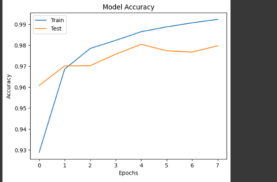
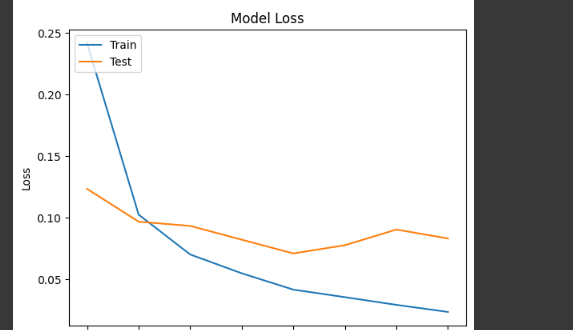
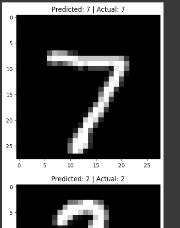

# Handwritten Digit Recognition using Neural Networks

This project is a deep learning model that recognizes handwritten digits (0-9) using the MNIST dataset. The model is built using TensorFlow and Keras, and it employs a fully connected neural network (Multi-Layer Perceptron) for classification. The project includes data preprocessing, model training, evaluation, and visualization of results.

## Table of Contents
- [Project Overview](#project-overview)
- [Dataset](#dataset)
- [Dependencies](#dependencies)
- [Installation](#installation)
- [Usage](#usage)
- [Model Architecture](#model-architecture)
- [Training and Evaluation](#training-and-evaluation)
- [Visualization](#visualization)
- [Testing on New Data](#testing-on-new-data)
- [Saving and Loading the Model](#saving-and-loading-the-model)
- [License](#license)

## Project Overview

The goal of this project is to build and train a neural network to recognize handwritten digits from the MNIST dataset. The dataset consists of 28x28 grayscale images of digits (0-9). The project involves:

- Loading and preprocessing the MNIST dataset.
- Building a neural network using Keras.
- Training the model with early stopping to prevent overfitting.
- Evaluating the model's performance on test data.
- Visualizing training and validation metrics.
- Testing the model on new data and saving/loading the model.

## Dataset

The **MNIST dataset** is used in this project. It contains:

- **60,000 training images** and **10,000 test images**.
- Each image is a 28x28 grayscale image of a handwritten digit (0-9).

The dataset is loaded directly from TensorFlow:

```python
mnist = keras.datasets.mnist
(x_train, y_train), (x_test, y_test) = mnist.load_data()

```

## Dependencies

To run this project, you need the following Python libraries:

- `numpy`
- `tensorflow`
- `keras`
- `matplotlib`

You can install these dependencies using `pip`:

```bash
pip install numpy tensorflow matplotlib
```

## Installation

1. Clone this repository to your local machine:

```bash
git clone https://github.com/amiladilshan7/Handwritten-Digit-Recognition-using-Neural-Networks.git
```

2. Navigate to the project directory:

```bash
cd Handwritten-Digit-Recognition-using-Neural-Networks

```

3. Install the required dependencies (if not already installed):

```bash
pip install -r requirements.txt
```

## Usage

1. Run the Python script to train the model and evaluate its performance:

```bash
python digit_recognition.py


```

The script will:
- Load and preprocess the MNIST dataset.
- Build and compile the neural network model.
- Train the model with early stopping.
- Evaluate the model on test data.
- Visualize training and validation metrics.
- Save the trained model for future use.

## Model Architecture

The neural network model is built using Keras and consists of the following layers:

1. **Input Layer**: Flattened 28x28 image (784 neurons).
2. **Hidden Layer 1**: 128 neurons with ReLU activation.
3. **Hidden Layer 2**: 64 neurons with ReLU activation.
4. **Output Layer**: 10 neurons with Softmax activation (one for each digit).

```python
model = keras.Sequential([
    keras.layers.Dense(128, activation='relu', input_shape=(784,)),
    keras.layers.Dense(64, activation='relu'),
    keras.layers.Dense(10, activation='softmax')
])
```

## Training and Evaluation

The model is trained using the **Adam optimizer** and **sparse categorical cross-entropy loss**. Early stopping is implemented to prevent overfitting.

- **Training Accuracy**: ~99.3%
- **Test Accuracy**: ~98.0%

### Training Output Example:
```
Epoch 1/50
1875/1875 ━━━━━━━━━━━━━━━━━━━━ 11s 5ms/step - accuracy: 0.8767 - loss: 0.4217 - val_accuracy: 0.9608 - val_loss: 0.1235
Epoch 2/50
1875/1875 ━━━━━━━━━━━━━━━━━━━━ 10s 5ms/step - accuracy: 0.9691 - loss: 0.1041 - val_accuracy: 0.9701 - val_loss: 0.0968
...
```

### Evaluation Output Example:
```
Test Loss: 0.07102559506893158
Test Accuracy: 0.980400025844574
```

## Visualization

The project includes visualizations of:

1. **Training and Validation Accuracy**:
   

2. **Training and Validation Loss**:
   

3. **Sample Predictions**:
   

## Testing on New Data

You can test the model on new handwritten digit images. The model will predict the digit and display the result.

```python
# Example: Predict on a new image
predicted_digit = model.predict(img_array)
print("Predicted Digit:", predicted_digit)
```

## Saving and Loading the Model

The trained model is saved as a `.h5` file for future use:

```python
model.save("handwritten_digit_model.h5")
```

To load the saved model:

```python
from tensorflow.keras.models import load_model
model = load_model("handwritten_digit_model.h5")
```

## License

This project is licensed under the MIT License. See the [LICENSE](LICENSE) file for details.

---

Feel free to contribute to this project by submitting issues or pull requests. If you have any questions, please contact me at [your-email@example.com](mailto:your-email@example.com).
```

### Notes:
1. Replace `your-username` with your actual GitHub username.
2. Replace `your-email@example.com` with your actual email address.
3. Ensure the `requirements.txt` file is included in the repository for easier dependency installation.
4. Add the generated plots (e.g., `accuracy_plot.png`, `loss_plot.png`, `sample_predictions.png`) to the repository for visualization.

This `README.md` file provides a clear and structured overview of your project, making it easy for others to understand and use your work.
